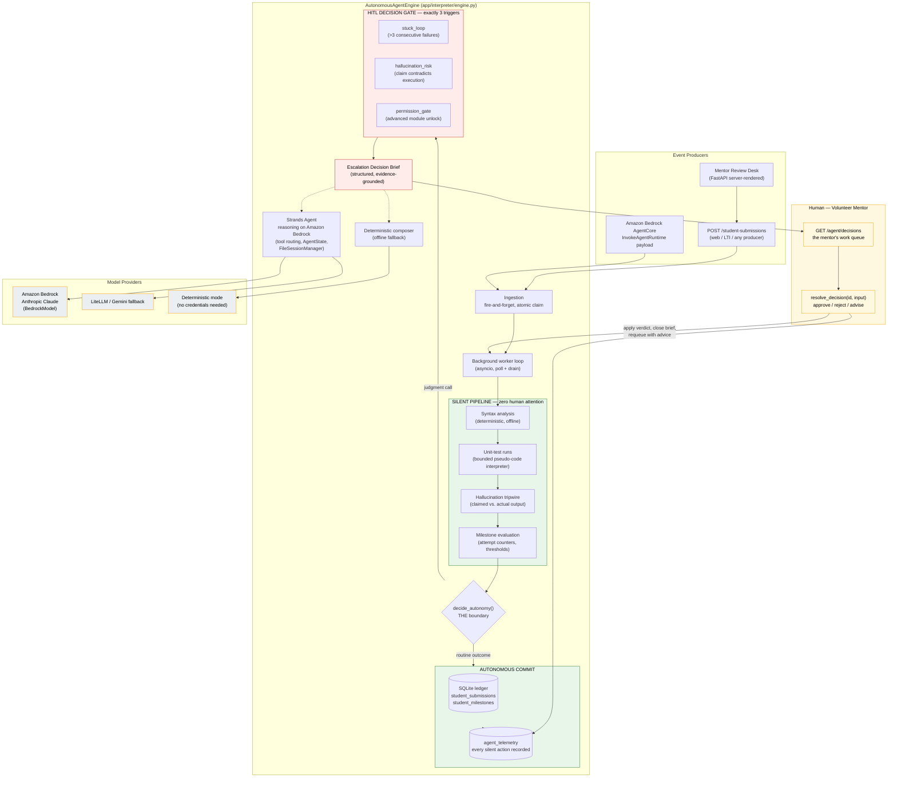
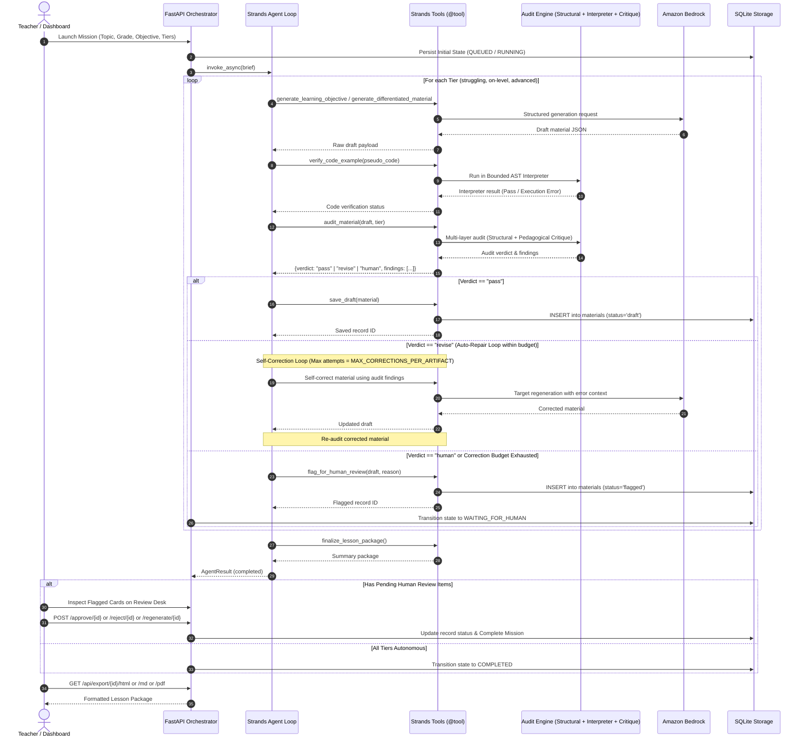
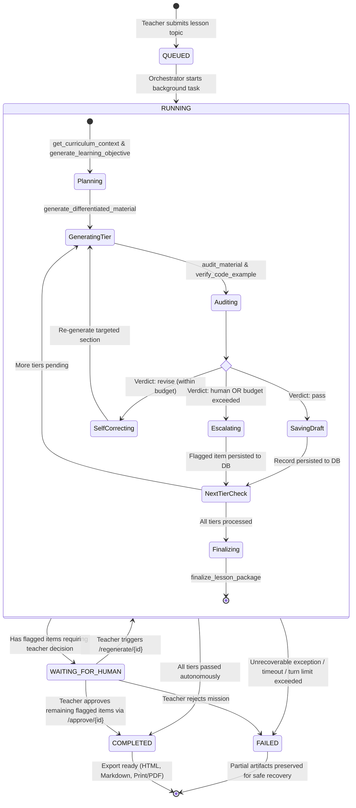

# Architecture

**IdentAI — Good Neighbor Agents: Autonomous Mentor Operations for Community Coding Centers**
Strands Agents SDK · Amazon Bedrock · Amazon Bedrock AgentCore · SQLite

The repo ships **two cooperating autonomous systems**. Part I is the
learning-operations runtime (the hackathon's core theme: an agent that works
silently and surfaces only for real decisions). Part II is the curriculum
design pipeline that generates and self-audits tiered teaching materials.

---

# Part I — Autonomous Learning Operations

## 1. The One-Sentence Model

> A background agent continuously ingests student learning events, evaluates
> them through a deterministic silent pipeline, commits routine outcomes to a
> SQLite ledger without telling anyone, and pauses for a human **only** when
> one of three explicitly-defined judgment gates trips — resuming autonomously
> the moment the mentor resolves the brief.

The architectural rule everything else serves:

> **AUTONOMOUS** — everything that is effort.
> **ESCALATION** — everything that is judgment. There are exactly three.

## 2. Mermaid Diagram — Full Ingestion, Evaluation and HITL Cycle



## 3. ASCII Diagram — Raw-Text Rendering

```
                            EVENT PRODUCERS
   students/web/LTI --> POST /student-submissions -->+
   AgentCore InvokeAgentRuntime ---------------------+
                                                     v
                                     +------------------------------+
                                     |   AUTONOMOUSAGENTENGINE      |
                                     |   (background worker loop)   |
                                     +---------------+--------------+
                                                     |  atomic claim
                                                     v
        +---------------- SILENT PIPELINE (no human, ever) ----------------+
        |  1. syntax analysis        (evaluator.analyze_syntax)             |
        |  2. unit-test runs         (bounded interpreter, step cap)        |
        |  3. hallucination tripwire (claimed output vs. actual)            |
        |  4. milestone evaluation   (consecutive failures vs. gate)        |
        +-------------------------------+-----------------------------------+
                                        |
                                 decide_autonomy()
                       THE autonomy boundary -- one function
                                        |
            +---------------------------+---------------------------+
            |                                                       |
     routine outcome                                         judgment call
            |                                                       |
            v                                                       v
   +--------------------------+          +----------------------------------------+
   | AUTONOMOUS COMMIT        |          | HITL GATE -- exactly 3 triggers        |
   |  - auto_passed           |          |  stuck_loop          (>3 fails)        |
   |  - auto_failed           |          |  hallucination_risk  (claim != run)    |
   |  - ledger + counters     |          |  permission_gate     (unlock)          |
   |  - telemetry row         |          |  >> evaluation PAUSES                  |
   |  (no notification)       |          |  >> Escalation Decision Brief          |
   +------------+-------------+          +--------------------+-------------------+
                |                                             |
                v                                             v
   +---------------------+          +------------------------------------------+
   | SQLite ledger       |          | mentor work queue                        |
   | agent_telemetry     |          | GET /agent/decisions                     |
   +---------------------+          +--------------------+---------------------+
                                                         |
                                                         v
                                     +------------------------------------------+
                                     |  MENTOR resolves the brief               |
                                     |  approve / reject / advise               |
                                     |  resolve_decision(id, input)             |
                                     +--------------------+---------------------+
                                                          |  verdict applied,
                                                          |  advice re-injected
                                                          v
                                     worker loop picks the item up again
                                     and resumes -- autonomously
```

## 4. Component Responsibility Matrix

| Component | Responsibility | Never does | Where |
|---|---|---|---|
| **AutonomousAgentEngine** (Agent Core) | Own the background loop: ingest, claim, orchestrate the silent pipeline, commit state transitions, open/close decision briefs, apply human verdicts | Never blocks ingestion on a human; never escalates outside the 3 gates; never dies on a bad submission | `app/interpreter/engine.py` |
| **Silent assessment layer** (evaluator) | Deterministic verdicts: syntax findings, unit-test results, claim contradictions, milestone states, and `decide_autonomy()` — the single authority on autonomous-vs-escalate | Never performs I/O with humans; never calls a model; never rewrites student code | `app/interpreter/evaluator.py` |
| **Bounded interpreter** | Execute student pseudo-code inside a hard step cap; typed `ExecutionResult` (ok/output/steps/error/line) | Never executes real languages; never runs unbounded; never raises past its typed result | `engine.py` (core), `models.py` |
| **HITL Decision Gate** | Open at most 3 categories of brief; freeze the affected submission/milestone; present one structured brief; apply approve/reject/advise; resume the loop | Never surfaces routine outcomes; never re-escalates a guided re-run on identical evidence; never unlocks an advanced module without an approval row | `engine.py` (`resolve_decision`, `_apply_resolution`) |
| **Strands escalation agent** (LLM provider) | Compose the brief narrative when a model is configured: tool routing (`run_code_tests`, `fetch_student_history`, `submit_decision_brief`), durable memory (`AgentState` + `FileSessionManager`), retry strategy | Never decides *whether* to escalate (the boundary is deterministic); cannot unlock the gated tool — an `InterventionHandler` denies it below the model; its failure never breaks autonomy | `engine.py` (`_build_agent`, `_compose_brief_with_agent`) |
| **Amazon Bedrock** | Foundation-model reasoning for brief composition and the curriculum-design agent (Anthropic Claude via Converse API); LiteLLM/Gemini fallback; AgentCore container runtime | Never consulted for the routine path — silent evaluation is 100% deterministic and free | `strands.models.BedrockModel`, `agentcore/` |
| **Amazon Bedrock AgentCore** | Host the containerized runtime: ECR image, registered runtime, `InvokeAgentRuntime` task protocol returning `AUTONOMOUS_COMPLETION` / `HUMAN_DECISION_REQUIRED` | Never stores state of its own — the engine's SQLite carries the truth | `agentcore/Dockerfile`, `deploy.sh`, `entrypoint.py` |
| **Persistence (SQLite)** | Durable truth: submissions, milestone counters, decision briefs, telemetry audit trail, materials, curriculum missions (incl. sub-mission drill-down across restarts) | Never trusts in-memory state for anything a restart must survive | `data/lessons.db` |
| **Mentor surfaces** | Review desk (curriculum approvals) + `GET /agent/decisions` + `resolve` route + the CLI demo | The only human entry points that exist — there is no other way to interrupt the agent | `app/main.py`, `demos/demo_scenario.py` |

## 5. Data Flow — One Submission, End to End

```
1. ingest_submission("dave", "while-loops", code, expected=["3"])
      - student_submissions row (status=pending) + milestone upsert      [durable]

2. worker claims the row atomically (BEGIN IMMEDIATE; status=processing)

3. SILENT PIPELINE
      syntax  : analyze_syntax()        -> SyntaxReport(ok, findings)
      tests   : run_unit_tests()        -> TestRunResult(ok, cases[])
                - bounded interpreter, step cap 5000, normalised output match
      claim   : assess_claim()          -> ClaimAssessment(hallucination_risk)
      verdict : evaluate_milestone()    -> MilestoneVerdict(state, escalate)

4. decide_autonomy(syntax, tests, claim, verdict) -> AutonomyDecision
      |
      +- routine -> commit: status=auto_passed/auto_failed, counters,
      |                     telemetry("submission_auto_processed")   [silence]
      +- escalate -> status=escalated, milestone=blocked,
                     Strands agent composes the brief (or deterministic),
                     agent_decisions row (status=open)                 [paused]

5. mentor: resolve_decision(id, "the loop body must change the variable",
                            resolution="advise")
      - decision closed, advice attached, submission requeued            [resumed]

6. guided re-run: counters NOT double-counted, escalation SUPPRESSED
      - telemetry("decision_resolved", human_intervention=true)
      - the next NEW submission re-arms the gate
```

**Why the boundary is safe:** the escalation decision is a pure function of
deterministic evidence — a model can phrase the brief, but it can never invent
a reason to interrupt a human, and it can never talk its way past the gated
`unlock_advanced_module` tool (an InterventionHandler denies it below the
model unless an approval row exists).

## 6. Failure and Degradation Posture

| Failure | Behaviour |
|---|---|
| Model provider unreachable / credentials missing | Escalation briefs compose deterministically; the loop never stops (`reasoning_fallback` telemetry) |
| Bad submission crashes the pipeline | Caught per-row, telemetry `submission_processing_error`, row re-queued; loop survives |
| Worker dies mid-processing | `processing` rows older than 5 minutes are reclaimed on next drain |
| Concurrent workers | Atomic `BEGIN IMMEDIATE` claim — no double-processing, no duplicate briefs |
| Mentor spams resolve | Already-resolved briefs raise `LookupError`; idempotent by contract |
| Process restart | Everything durable: queue, counters, open briefs, agent session memory (`FileSessionManager`) |

---

# Part II — Curriculum Design Pipeline

_Verified against the codebase and exercised by the verification suite
(`python verify.py --deep`)._


This document maps the **actual code** in `app/main.py` and its supporting modules to the system architecture. Every claim below is verified against the codebase and tested by the verification suite (`verify.py`).

---

## 1. System Architecture Diagram

```mermaid
flowchart TD
    subgraph ClientLayer ["1. Teacher / Client Layer"]
        Browser["Teacher Browser / Review Desk<br/>(Tailwind-styled Server-Rendered UI)"]
        APIClient["API Consumers & CLI<br/>(REST / JSON)"]
    end

    subgraph FastAPILayer ["2. FastAPI Application (app/main.py & main.py)"]
        Routes["HTTP Endpoints<br/>- POST /missions, /process-lesson<br/>- GET /api/curriculum-missions/*<br/>- GET /api/export/{id}/{html,md,pdf}<br/>- POST /approve/{id}, /reject/{id}, /regenerate/{id}<br/>- GET /api/missions/{id}/events"]
        Orchestrator["Mission Orchestrator & State Machine<br/>(CurriculumMission, Mission, Async Queue)"]
    end

    subgraph AgentLayer ["3. Strands Autonomous Agent Layer"]
        StrandsAgent["Strands Agent Instance (Agent)<br/>- System Prompt (6-8th Grade CS Pedagogy)<br/>- ModelRetryStrategy (Exponential Backoff)<br/>- Limits (Turn Budget & Execution Caps)"]
    end

    subgraph ToolsLayer ["4. The 10 Strands Tools (@tool)"]
        T1["1. get_curriculum_context"]
        T2["2. generate_learning_objective"]
        T3["3. generate_differentiated_material"]
        T4["4. generate_assessment"]
        T5["5. generate_misconception_distractors"]
        T6["6. audit_material"]
        T7["7. verify_code_example"]
        T8["8. save_draft"]
        T9["9. flag_for_human_review"]
        T10["10. finalize_lesson_package"]
    end

    subgraph ValidationEngine ["5. Hybrid Auditing & Verification Engine"]
        StructuralCheck["Structural / Schema Validator<br/>(Heuristics, Blooms Taxonomy, Sections)"]
        CodeInterpreter["Bounded Pseudo-code Interpreter<br/>(app/interpreter/ - Loop & AST Verifier)"]
        ModelCritique["Pedagogical LLM Critique Pass<br/>(Distractor Diagnostics, Age Appropriateness)"]
    end

    subgraph ModelDispatch ["6. Model Provider Dispatch (_complete)"]
        Dispatcher{"Provider Routing<br/>(MODEL_PROVIDER)"}
        Bedrock["Amazon Bedrock (Primary)<br/>- BedrockModel (Strands Agent Loop)<br/>- boto3 bedrock-runtime.converse (Tools)"]
        LiteLLM["LiteLLM / Gemini (Fallback)<br/>- LiteLLMModel (Strands Loop)<br/>- litellm.completion (Tools)"]
    end

    subgraph PersistenceLayer ["7. Persistence & Event Stream"]
        LessonsDB[("lessons.db<br/>(aiosqlite durable storage)")]
        MissionDB[("curriculum_mission_state.db<br/>(Mission snapshot & recovery)")]
        EventStream["Canonical Event Log<br/>(mission_started, tool_called, audit_failed,<br/>self_correction, human_review, completed)"]
    end

    Browser -->|HTTP / UI Action| Routes
    APIClient -->|JSON Requests| Routes
    Routes --> Orchestrator
    Orchestrator -->|build_agent / invoke_async| StrandsAgent
    StrandsAgent -->|Autonomous Invocation| ToolsLayer

    T6 --> StructuralCheck
    T6 --> ModelCritique
    T7 --> CodeInterpreter

    StrandsAgent -.->|Reasoning Loop| Dispatcher
    T2 & T3 & T4 & T5 & ModelCritique -.->|_complete() JSON call| Dispatcher

    Dispatcher -->|AWS Bedrock API| Bedrock
    Dispatcher -->|LiteLLM API| LiteLLM

    T8 -->|Durable Save| LessonsDB
    T9 -->|Flag Review| LessonsDB
    Orchestrator -->|State Persist| MissionDB
    Orchestrator -->|Stream Events| EventStream
    Routes -->|Read Materials & Events| LessonsDB
    Routes -->|Read Canonical Stream| EventStream
```

---

## 2. Autonomous Execution & Self-Correction Flowchart



---

## 3. Mission State Machine & Lifecycle



---

## 4. Source Code Mapping & Verified Architecture Claims

Every claim below is verified against the codebase in `app/main.py`, `app/interpreter/`, and the test suite:

| Component / Claim | Location in Codebase | Reality & Implementation |
| --- | --- | --- |
| **Strands Framework** | `app/main.py:37` | Real import: `from strands import Agent, tool` (`strands-agents>=1.53.0`). |
| **The 10 Agent Tools** | `app/main.py:3300-4100` | Real Strands `@tool` decorators configured into `Agent(tools=AGENT_TOOLS)`. |
| **Bedrock Model** | `app/main.py:4270, 4380` | Real `strands.models.bedrock.BedrockModel` initialized for Strands agent loop. |
| **Bounded Code Interpreter** | `app/interpreter/` | Safe AST-based execution simulator for middle-school pseudo-code algorithms. |
| **Model Retry & Limits** | `app/main.py:4370-4400` | Native Strands `ModelRetryStrategy` (exponential backoff) and `Limits` turn caps. |
| **Bedrock Converse API** | `app/main.py:860-910` | Real `boto3.client('bedrock-runtime').converse(**kwargs)` with JSON salvaging. |
| **LiteLLM Fallback** | `app/main.py:890-930` | `litellm.completion` active when `MODEL_PROVIDER=litellm` (e.g. Gemini). |
| **FastAPI Backend** | `app/main.py` & `main.py` | FastAPI application with async endpoints, CORS, background tasks, and HTML UI. |
| **Persistence (SQLite)** | `data/lessons.db`, `data/curriculum_mission_state.db` | Durable async SQLite storage via `aiosqlite` with schema migrations. |
| **Verification Suite** | `verify.py` | 229 offline end-to-end integration and unit validation checks. |

### Dual Model-Call Dispatch Architecture

The system uses two complementary model call pathways:

1. **The Strands Reasoning Path:**  
   `agent.invoke_async(brief)` runs the agent loop inside Strands. Strands' event loop calls `BedrockModel.stream_messages` (or Converse) for reasoning, evaluates which of the 10 tools to invoke next, passes tool inputs, and processes tool returns.

2. **The Tool-Internal Generation Path:**  
   Tools that require structured JSON outputs (`generate_learning_objective`, `generate_differentiated_material`, `generate_assessment`, `generate_misconception_distractors`, and the pedagogical critique pass) call `_complete(system, user, json_mode=True)`.  
   `_complete` dispatches directly to **Amazon Bedrock Converse API** (`boto3`) or **LiteLLM**, isolating structured schema generation and JSON repair from multi-turn agent conversation chatter.

---

## 5. AWS Services & AgentCore Deployment

| Service | Role in System | Code Path |
| --- | --- | --- |
| **Amazon Bedrock** (`bedrock-runtime`) | Model Converse API for structured generation and audits | `_bedrock_converse` in `app/main.py`, `boto3.client("bedrock-runtime")` |
| **Amazon Bedrock** (`strands.models.bedrock`) | Agent reasoning loop and tool orchestrator | `BedrockModel` configured in `build_agent()` |
| **AWS IAM / Credentials** | Standard credential resolution (env, `~/.aws/credentials`, IAM roles) | Boto3 default session chain |
| **Amazon Bedrock AgentCore** | Production container packaging & deployment runtime | `agentcore/Dockerfile`, `agentcore/entrypoint.py`, `agentcore/deploy.sh` |

### AgentCore Production Packaging (`agentcore/`)
- `Dockerfile`: Python 3.12 container bundling dependencies and ASGI server.
- `entrypoint.py`: Container entrypoint that binds `app.main:app` to port 8080.
- `deploy.sh`: Script for building image and provisioning runtime on AWS Bedrock AgentCore.
- `invoke.sh`: Smoke-test script for dispatching topic briefs to the deployed runtime.

---

## 6. Durable State, Recovery & Observability

### Durable State & Safe Mission Recovery
- **Materials Database (`data/lessons.db`)**: All saved drafts, flagged items, assessments, and teacher reviews are written transactionally.
- **Mission State Database (`data/curriculum_mission_state.db`)**: Curriculum mission snapshots, tier statuses (`saved`, `flagged`, `failed`, `pending`), and state transitions are persisted on every event.
- **Crash Recovery**: If the server or process restarts mid-mission, existing materials are preserved. The teacher can inspect the persisted state and resume remaining tiers without duplicating completed work.

### Canonical Observability Event Log (`GET /api/missions/{id}/events`)
The system emits a canonical event stream for full transparency:
- `mission_started`: Mission initialisation with topic, grade level, and tier parameters.
- `agent_action`: Strands agent decision to execute an action.
- `tool_called` / `tool_completed`: Granular tool execution tracking with runtime metrics.
- `audit_failed`: Structured audit findings when an artifact requires revision.
- `self_correction`: Autonomous agent remediation action.
- `human_review_required`: Escalation event when pedagogical human input is needed.
- `human_review_completed`: Teacher approval/rejection timestamp and notes.
- `mission_completed`: Finalized package with impact metrics.

---

## 7. Autonomous Scope vs Human-in-the-Loop Governance

| Task / Responsibility | Autonomy Level | Description |
| --- | --- | --- |
| **Tool Selection & Step Planning** | Autonomous | Strands agent event loop decides sequence of operations |
| **Differentiated Material Writing** | Autonomous | Generates tier-tailored worksheets, analogies, and quizzes |
| **Multi-layer Quality Audits** | Autonomous | Structural checks + AST code interpretation + pedagogical critique |
| **Self-Correction & Auto-Repair** | Autonomous | Automatically regenerates failed sections up to retry budget limit |
| **Pedagogical Escalation** | Autonomous | Automatically detects ambiguous or sensitive edge cases and flags them |
| **Approve / Reject Decisions** | Human-in-the-Loop | Reserved exclusively for the teacher via the Review Desk |
| **Classroom Export** | Teacher-Initiated | Formats approved materials to Markdown, HTML, or Print/PDF |
